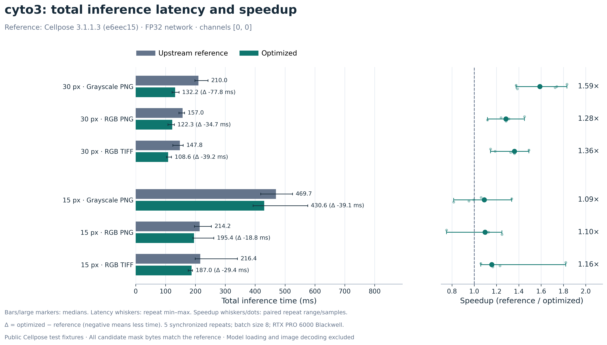
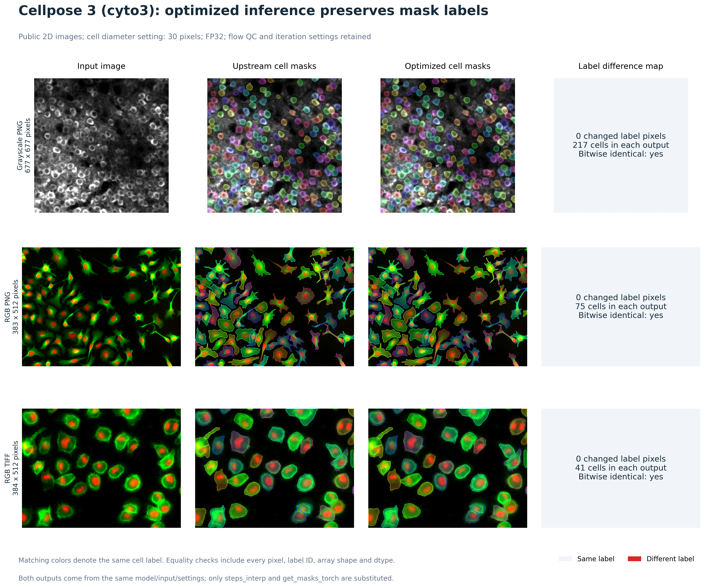
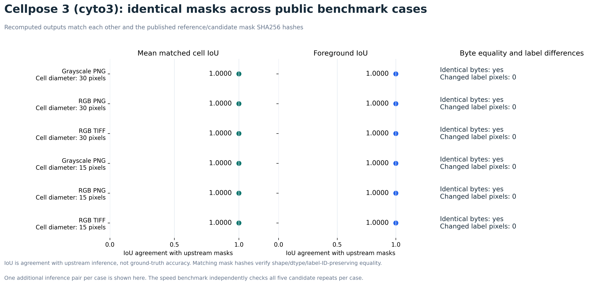

# Cellpose 3 inference benchmarks

| Figure | What it shows |
| --- | --- |
| [Full inference time](figures/cyto3_inference.png) | Measured latency and speedup |
| [Identical cell masks](figures/cyto3_identical_masks.png) | Input, upstream masks, optimized masks and pixel differences |
| [Mask IoU and byte equality](figures/cyto3_mask_iou.png) | Cell/foreground IoU = 1.0000 and zero changed labels across six public cases |

For Cellpose-SAM **3D timing plots and standalone IoU plots**, see the
[SAM figure gallery on the fast-sam-inference branch](https://github.com/dean-tessone/cellpose/blob/fast-sam-inference/benchmarks/figures/README.md).
This branch contains the cyto3 2D inference measurements.

This contribution targets MouseLand/cellpose's `cp3` branch, currently the same
commit as `v3.1.1.3` (`e6eec1537501436c48a2c75d23f2aa61f8d715fd`). It accelerates
cyto3 mask dynamics through the existing `CellposeModel.eval` API.

The implementation updates all Euler coordinates in two tensor operations per
step, gathers seed windows together, pools binary seed masks with PyTorch's
native 2D/3D kernels, and assigns labels with an integer maximum scatter. The
maximum preserves the original rule that later seeds overwrite earlier seeds.
Normalization, network precision, tile positions, resizing, iteration counts,
flow quality control, hole filling, size filtering, and label renumbering retain
the upstream implementation. Older PyTorch versions without `scatter_reduce_`
use ordered label assignment. Window gathering and maximum scatter are also
present in newer Cellpose main; this is a port to the cyto3 branch, with additional
coordinate and seed pooling optimizations.

Run the regression tests and randomized differential audit from this checkout:

```bash
python -m unittest discover -s tests -p test_exact_dynamics.py -v
python benchmarks/audit_exact_masks.py --output /tmp/cyto3-audit.json
```

The unit tests compare the exact FP32 coordinate updates for 2D/3D integration,
including zero flow, large displacements, single points, and 0/1/200 iterations.
They also check border seeds, overlapping equal-height seeds, the seed count
threshold, oversized mask removal, and the compatibility assignment path. The
audit compares 320 randomized mask constructions against the original git
revision on CPU and CUDA, including tied seeds and four maximum size fractions.
These checks passed on the machine used for the speed measurements. MPS and
historical PyTorch installations were not exercised.

The public inputs are Cellpose's own test fixtures, downloaded from the source
used by [upstream conftest.py](https://github.com/MouseLand/cellpose/blob/main/conftest.py).
They are a small reproducible evaluation set, rather than the full held-out
Cellpose dataset. No ground-truth accuracy score is claimed; masks are compared
against the unmodified cyto3 inference result.

```bash
curl -L --fail https://osf.io/download/s52q3/ -o /tmp/cellpose-data.zip
unzip /tmp/cellpose-data.zip -d /tmp/cellpose-fixtures
python benchmarks/benchmark_cyto3.py \
  --images /tmp/cellpose-fixtures/data/2D/gray_2D.png \
           /tmp/cellpose-fixtures/data/2D/rgb_2D.png \
           /tmp/cellpose-fixtures/data/2D/rgb_2D_tif.tif \
  --output /tmp/cyto3-public.json
```

The script imports this checkout directly. An environment with Cellpose 3's
dependencies, NumPy, PyTorch and the cyto3 weights is required. The default model
loader downloads weights when they are absent. The unmodified reference functions
are extracted from the local `v3.1.1.3` git tag, so retain that tag in the checkout.

Measurements include the entire `CellposeModel.eval` call, including normalization,
network inference, mask quality control, returned flows and styles. Input decoding
and model loading are excluded. Each implementation receives two warmup calls per
image/diameter, then five synchronized timed calls with alternating order. Both
use FP32, batch size 8, channels `[0, 0]`, overlap 0.1, flow threshold 0.4,
minimum size 15, and upstream iteration defaults. Diameters 30 and 15 exercise
rescaling factors 1 and 2. Every timed candidate mask is checked for identical
shape, dtype and bytes, against a repeated stable baseline. Flows and styles are
also checked in every repeat. Raw reports record timings, mask hashes, model and
image hashes, peak allocated GPU memory and the runtime environment.

The measured machine used an NVIDIA RTX PRO 6000 Blackwell Max-Q Workstation
Edition, PyTorch 2.9.1+cu128, and eight CPU threads. Other GPU jobs were active;
these are indicative measurements on shared hardware. No cross-device bitwise
guarantee or extrapolation to other hardware is claimed.

PR figures (public test fixtures):



These are **2D images**. The diameter labels specify the requested cell diameter in pixels. The left panel shows median full-inference latency and the change in milliseconds.
The right panel shows the ratio of median reference time to median optimized time.
Whiskers are observed repeat ranges, not confidence intervals. GPU load was shared.
[SVG](figures/cyto3_inference.svg) | [PDF](figures/cyto3_inference.pdf) |
[Numerical summary](figures/cyto3_inference_summary.csv)

Regenerate these figures with NumPy and Matplotlib installed:

```bash
python benchmarks/plot_benchmarks.py --kind cyto3 \
  --report benchmarks/results/public-rtx-pro-6000.json \
  --output-dir benchmarks/figures
```

## Visual mask equality



The three public 2D inputs are shown with the same cell colors in each output.
The difference maps compare every label pixel, including background and label
IDs. Every map contains zero differences. The displayed masks were recomputed
from both implementations and match the mask SHA256 hashes in the published
speed report. Mask, flow and style shapes/dtypes/bytes also match each other.



All six public image/diameter cases have cell IoU and foreground IoU of 1.0000.
IoU measures agreement with upstream inference, rather than manual-label
accuracy. Byte equality is checked separately because IoU alone would not
detect changed label IDs. The figure uses one newly computed pair per case;
the original benchmark checks all five timed candidate repeats per case.

[Mask overlays SVG](figures/cyto3_identical_masks.svg) | [PDF](figures/cyto3_identical_masks.pdf) |
[IoU/equality SVG](figures/cyto3_mask_iou.svg) | [PDF](figures/cyto3_mask_iou.pdf) |
[Equality data and mask hashes](figures/cyto3_mask_equality.json)

Reproduce these figures using the public benchmark report generated above:

```bash
python benchmarks/plot_exact_masks.py --report /tmp/cyto3-public.json \
  --images /tmp/cellpose-fixtures/data/2D/gray_2D.png \
           /tmp/cellpose-fixtures/data/2D/rgb_2D.png \
           /tmp/cellpose-fixtures/data/2D/rgb_2D_tif.tif \
  --output-dir /tmp/cyto3-mask-figures
```

The script checks weights, inputs and mask hashes against the supplied report
and stops if equality or provenance checks fail. The default report is the
committed public RTX PRO 6000 report used for the figures in this branch.

Measured medians in milliseconds (all candidate masks exact in all five repeats):

Dimension order is **height x width in pixels** for 2D, and **depth x height x width in voxels** for 3D. Channels are excluded. Network dimensions are after diameter-based resizing and before padding/tiling.

| Input | Input spatial dimensions | Network spatial dimensions | Cell diameter (pixels) | Upstream | Optimized | Speedup |
| --- | --- | --- | ---: | ---: | ---: | ---: |
| gray_2D.png | 677 x 677 | 677 x 677 | 30 | 210.0 | 132.2 | 1.59x |
| rgb_2D.png | 383 x 512 | 383 x 512 | 30 | 157.0 | 122.3 | 1.28x |
| rgb_2D_tif.tif | 384 x 512 | 384 x 512 | 30 | 147.8 | 108.6 | 1.36x |
| gray_2D.png | 677 x 677 | 1354 x 1354 | 15 | 469.7 | 430.6 | 1.09x |
| rgb_2D.png | 383 x 512 | 766 x 1024 | 15 | 214.2 | 195.4 | 1.10x |
| rgb_2D_tif.tif | 384 x 512 | 768 x 1024 | 15 | 216.4 | 187.0 | 1.16x |
| Microscopy A | 1004 x 1362 | 1004 x 1362 | 30 | 823.3 | 396.2 | 2.08x |
| Microscopy B | 1004 x 1362 | 1004 x 1362 | 30 | 902.7 | 453.7 | 1.99x |
| Microscopy C | 1004 x 1362 | 1004 x 1362 | 30 | 627.5 | 436.6 | 1.44x |
| Microscopy A | 1004 x 1362 | 2008 x 2724 | 15 | 2267.6 | 1159.6 | 1.96x |
| Microscopy B | 1004 x 1362 | 2008 x 2724 | 15 | 2504.6 | 1180.1 | 2.12x |
| Microscopy C | 1004 x 1362 | 2008 x 2724 | 15 | 2228.8 | 1117.2 | 2.00x |

Supplemental inputs were three 1004 x 1362 uint16 RGB microscopy images.
These supplemental image files are not distributed. Public measurements
are in [results/public-rtx-pro-6000.json](results/public-rtx-pro-6000.json).

Public fixtures: total of the per-case median latencies improves by 1.20x.

Supplemental microscopy: total of the per-case median latencies improves by 1.97x.
