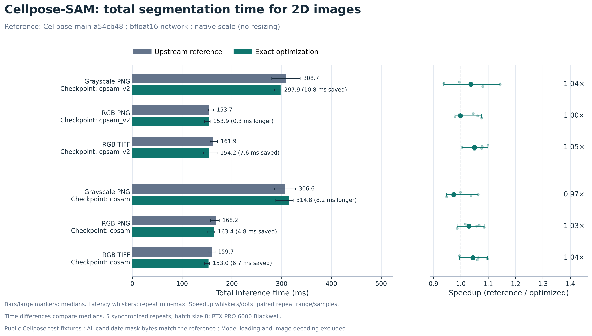
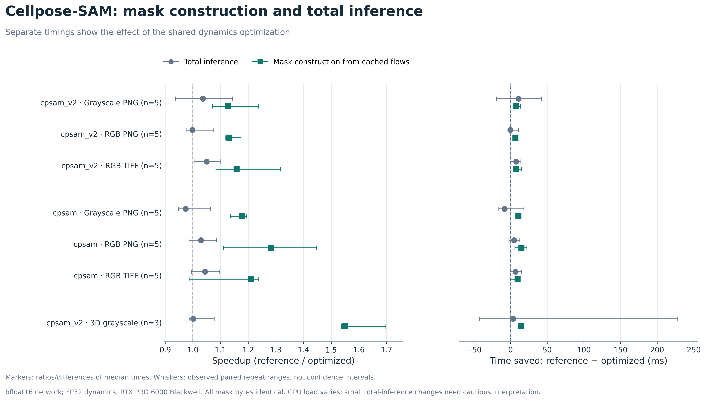
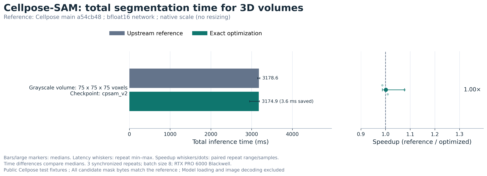
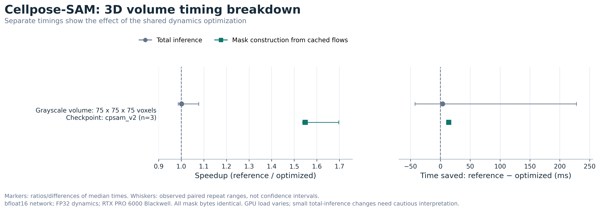
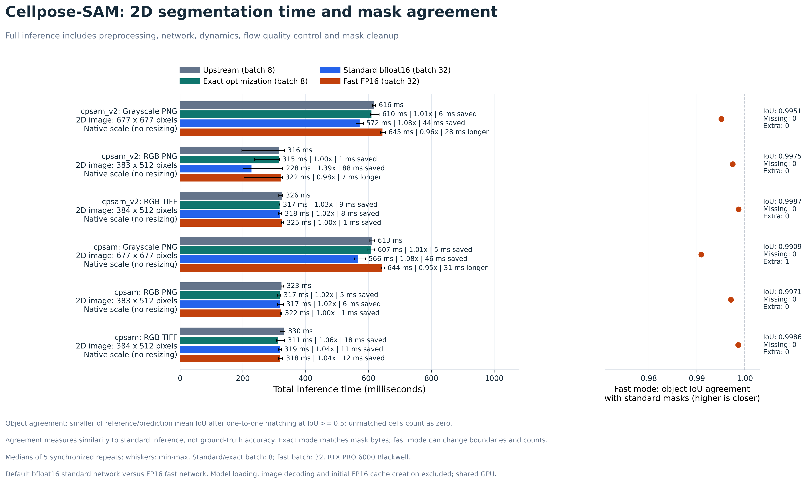
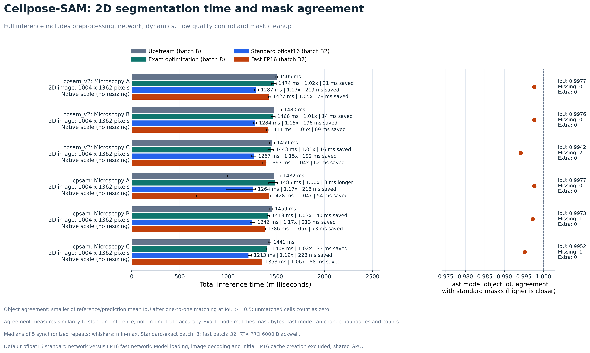
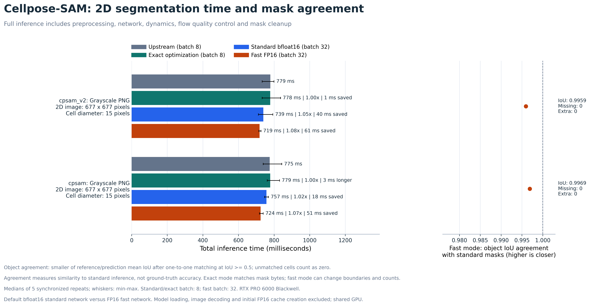

# Cellpose-SAM inference benchmarks

## Figure index

View these on the **`fast-sam-inference` branch**. The `fast-cyto3-inference`
branch contains Cellpose 3 results.

| Result | Plot |
| --- | --- |
| 3D volume: total inference time | [3D total-time plot](figures/sam_3d_inference.png) |
| 3D volume: mask construction speedup | [3D timing breakdown](figures/sam_3d_mask_effect.png) |
| 2D public images: object and foreground IoU | [Standalone public IoU plot](figures/sam_2d_iou_public.png) |
| 2D larger images: object and foreground IoU | [Standalone supplemental IoU plot](figures/sam_2d_iou_supplemental.png) |
| 2D resized images: object and foreground IoU | [Standalone resized IoU plot](figures/sam_2d_iou_scaled.png) |
| 2D public images: full time and mask agreement | [Inference options plot](figures/sam_fast_inference.png) |

See the [figure gallery](figures/README.md) for previews and SVG/PDF downloads.
The 3D plots measure the exact optimization; optional FP16 fast mode supports
unaugmented CUDA 2D inference and falls back to standard inference for 3D.

## Exact dynamics optimization

This contribution targets current Cellpose **main**, based on
`a54cb48849b7e225a81e8e43dcb042d42427f543`. It optimizes shared mask dynamics used
by Cellpose-SAM and the other current model backbones.

The runtime patch changes two operations in `cellpose/dynamics.py`:

* Update all flow coordinates together after `grid_sample`, keeping the FP32
  addition and clamp as separate operations. Per-coordinate arithmetic remains
  the same; 2D uses two arithmetic calls instead of four per step, and 3D uses
  two instead of six.
* Grow binary seed masks with native `max_pool2d`/`max_pool3d` instead of a
  sequence of axis-wise tensor operations. Since these masks contain only 0 and
  1, native pooling preserves the values, including boundary maxima and ties.

For standard inference (`fast=False`), the histogram pooling, seed ordering, seed gathering, maximum scatter, mask
quality control, hole filling, label renumbering, normalization, resizing,
network weights and network precision retain upstream behavior. Current main
already includes vectorized seed gathering and maximum scatter. This change
reduces additional coordinate and pooling overhead with no new runtime dependency
for the default path. An optional approximate inference mode is described below.

Validation passed for both `cpsam` and main's default `cpsam_v2`, using upstream's
default bfloat16 network weights. It also passed for FP32, diameter 15 rescaling,
and a 3D volume. Across the runs listed below, all **93 timed full inference calls**
returned mask, flow and style arrays identical in shape, dtype and bytes to a
stable unmodified reference. All **93 timed cached-flow mask calls** also returned
identical mask bytes. The test run passed five tests (four new regression tests
and the existing upstream dynamics test), including 120 subtests. The randomized
CPU/CUDA differential audit passed 320 2D/3D mask comparisons.

MPS, other CUDA architectures, historical PyTorch versions, DINO end-to-end
inference and the full upstream GUI/training suite were not exercised. DINO uses
the same modified dynamics functions, but no DINO speed result is claimed.

Reproduce the checks in an environment with current Cellpose's dependencies:

```bash
python -m pytest tests/test_exact_dynamics.py tests/test_dynamics.py -q
python benchmarks/audit_exact_masks.py --output /tmp/sam-mask-audit.json
```

The tests cover exact coordinate bytes for 2D and 3D on CPU and CUDA, empty/single/
multiple point sets, 0/1/200 steps, zero flow and large displacements. Seed tests
cover image boundaries, overlapping equal-height seeds, the seed count threshold
and oversized mask removal. The audit uses randomized seeds with ties and
overlapping windows, and four maximum mask size fractions.

The public inputs are Cellpose's own test fixtures, from the source used by
[upstream conftest.py](https://github.com/MouseLand/cellpose/blob/a54cb48849b7e225a81e8e43dcb042d42427f543/conftest.py).
They provide a small reproducible performance evaluation, not a full held-out
dataset benchmark or a ground-truth segmentation accuracy score. The equality
reference is inference from unmodified main on the same model and inputs.

```bash
curl -L --fail https://osf.io/download/s52q3/ -o /tmp/cellpose-data.zip
unzip /tmp/cellpose-data.zip -d /tmp/cellpose-fixtures
python benchmarks/benchmark_sam.py \
  --images /tmp/cellpose-fixtures/data/2D/gray_2D.png \
           /tmp/cellpose-fixtures/data/2D/rgb_2D.png \
           /tmp/cellpose-fixtures/data/2D/rgb_2D_tif.tif \
  --output /tmp/sam-public.json
```

Weights are cached in `CELLPOSE_LOCAL_MODELS_PATH` or the usual `.cellpose/models`
directory. For the exact checkpoints used here, obtain `cpsam` and `cpsam_v2` from
[this pinned model revision](https://huggingface.co/mouseland/cellpose-sam/tree/7c61431b5fbb078f3296754bd15d9f51b320f837).
Raw reports include model and image SHA256 hashes. Weights and private images
are not included in this branch.

Additional configurations:

```bash
# Both checkpoints with twice the network input resolution, 100 dynamics steps
python benchmarks/benchmark_sam.py --images /path/to/gray_2D.png \
  --diameters 15 --output /tmp/sam-scaled.json

# FP32 network weights with the upstream TF32 setting preserved
python benchmarks/benchmark_sam.py --images /path/to/rgb_2D.png \
  --models cpsam_v2 --float32 --output /tmp/sam-float32.json

# Public 75 x 75 x 75 grayscale volume, depth on axis 0
python benchmarks/benchmark_sam.py --images /path/to/gray_3D.tif \
  --models cpsam_v2 --do-3d --z-axis 0 --repeats 3 --warmup 1 \
  --output /tmp/sam-3d.json
```

The reference functions are loaded from the pinned main revision in this git
checkout. Both implementations share the same model object and input, and the
only substituted functions are `steps_interp` and `get_masks_torch`. The full
inference timer includes the entire `CellposeModel.eval` call, including image
conversion, normalization, tiling, network inference, flow QC and mask cleanup.
It excludes image decoding and model loading. The mask timer uses the same
cached network flows through `_compute_masks`, including flow QC and cleanup.
It excludes network inference. Every timed result is checked after the timer.

Default settings are two warmups per implementation and image, five synchronized
repeats with alternating reference/candidate order, tile batch size 8, native
diameter (`None`), tile overlap 0.1, resampling enabled, flow threshold 0.4, and
minimum mask size 15. The 3D case uses one warmup and three repeats. A noisy supplemental microscopy
case was additionally measured with 15 repeats; both the initial and repeated
measurements are reported. No cases failing a speed threshold were discarded.

The machine was an NVIDIA RTX PRO 6000 Blackwell Max-Q Workstation Edition with
PyTorch 2.9.1+cu128, Python 3.12.13 and eight CPU threads. The network uses default
bfloat16 unless explicitly marked FP32; dynamics use FP32 as upstream does. Other
GPU jobs were active, and full-inference differences of a few percent should not
be treated as a reliable overall speedup on this shared machine. Raw timing
samples and environment flags are included in `results/` for the public inputs.

On the default public 2D fixtures, the measured mask-stage improvement was
**1.13–1.28x**. The 3D case's mask stage improved **1.55x** (39.3 to 25.3 ms), while
its full inference time stayed around 3.18 seconds. Larger supplemental microscopy images showed
small overall timing differences. This supports a mask dynamics optimization;
it does not demonstrate a large SAM network or full-inference speedup.

PR figures (public test fixtures):



The left panel shows median full-inference latency and the change in milliseconds.
The right panel shows the ratio of median reference time to median optimized time.



The second figure compares full inference with mask construction from cached
network flows, for 2D images. The 3D volume is plotted separately below. Whiskers are observed repeat ranges,
not confidence intervals. Shared GPU load makes small full-inference differences
uncertain; the mask-stage speedup is shown separately.





[Inference SVG](figures/sam_inference.svg) | [Inference PDF](figures/sam_inference.pdf) |
[Mask-stage SVG](figures/sam_mask_effect.svg) | [Mask-stage PDF](figures/sam_mask_effect.pdf)

Regenerate these figures with NumPy and Matplotlib installed:

```bash
python benchmarks/plot_benchmarks.py --kind sam \
  --report benchmarks/results/public.json \
  --volume-report benchmarks/results/public-3d.json \
  --output-dir benchmarks/figures
```

Median latencies in milliseconds. All candidate masks, flows and styles matched
the reference bytes in every timed repeat.

Dimension order is **height x width in pixels** for 2D, and **depth x height x width in voxels** for 3D. Channels are excluded. Network dimensions are after diameter-based resizing and before padding/tiling.

| Input/configuration | Input spatial dimensions | Network spatial dimensions | Model | Eval reference | Eval optimized | Mask reference | Mask optimized | Mask speedup |
| --- | --- | --- | --- | ---: | ---: | ---: | ---: | ---: |
| gray_2D.png | 677 x 677 | 677 x 677 | cpsam_v2 | 308.7 | 297.9 | 66.2 | 58.7 | 1.13x |
| rgb_2D.png | 383 x 512 | 383 x 512 | cpsam_v2 | 153.7 | 153.9 | 57.9 | 51.2 | 1.13x |
| rgb_2D_tif.tif | 384 x 512 | 384 x 512 | cpsam_v2 | 161.9 | 154.2 | 58.0 | 50.1 | 1.16x |
| gray_2D.png | 677 x 677 | 677 x 677 | cpsam | 306.6 | 314.8 | 72.3 | 61.4 | 1.18x |
| rgb_2D.png | 383 x 512 | 383 x 512 | cpsam | 168.2 | 163.4 | 67.5 | 52.7 | 1.28x |
| rgb_2D_tif.tif | 384 x 512 | 384 x 512 | cpsam | 159.7 | 153.0 | 54.8 | 45.3 | 1.21x |
| Microscopy A | 1004 x 1362 | 1004 x 1362 | cpsam_v2 | 828.8 | 819.9 | 148.8 | 139.8 | 1.06x |
| Microscopy B | 1004 x 1362 | 1004 x 1362 | cpsam_v2 | 814.0 | 803.0 | 146.7 | 142.9 | 1.03x |
| Microscopy C | 1004 x 1362 | 1004 x 1362 | cpsam_v2 | 766.4 | 776.3 | 111.2 | 103.1 | 1.08x |
| Microscopy A | 1004 x 1362 | 1004 x 1362 | cpsam | 771.2 | 783.7 | 145.0 | 141.1 | 1.03x |
| Microscopy B | 1004 x 1362 | 1004 x 1362 | cpsam | 806.9 | 810.0 | 152.7 | 146.3 | 1.04x |
| Microscopy C | 1004 x 1362 | 1004 x 1362 | cpsam | 765.9 | 756.6 | 107.0 | 114.6 | 0.93x |
| gray_2D.png (diameter 15) | 677 x 677 | 1354 x 1354 | cpsam_v2 | 853.6 | 859.5 | 71.8 | 67.2 | 1.07x |
| gray_2D.png (diameter 15) | 677 x 677 | 1354 x 1354 | cpsam | 878.2 | 889.2 | 69.0 | 63.3 | 1.09x |
| rgb_2D.png (FP32) | 383 x 512 | 383 x 512 | cpsam_v2 | 205.9 | 202.4 | 58.4 | 49.5 | 1.18x |
| gray_3D.tif (3D) | 75 x 75 x 75 | 75 x 75 x 75 | cpsam_v2 | 3178.6 | 3174.9 | 39.3 | 25.3 | 1.55x |
| Microscopy C (15 repeats) | 1004 x 1362 | 1004 x 1362 | cpsam | 646.9 | 645.1 | 105.7 | 97.5 | 1.08x |

Supplemental inputs were three 1004 x 1362 uint16 RGB microscopy images.
These supplemental image files are not distributed. The initial Microscopy C
`cpsam` mask-stage result was noisy and slower; the longer repeat measured a
1.08x speedup. This is reported alongside the initial result.


## Optional approximate fast mode

`model.eval(image, fast=True)` and CLI `--fast` opt into FP16 network execution,
GPU percentile normalization, bilinear resizing, tile extraction/averaging, and
reusable pinned input buffers. The default tile batch size becomes 32; explicitly
setting `batch_size=8` keeps that value. Flow QC (default threshold 0.4), the usual
iteration count, and mask cleanup are retained. This mode **is not bitwise
identical** and can change cell boundaries and counts. It is disabled by default.

```python
from cellpose import models
model = models.CellposeModel(gpu=True, pretrained_model="cpsam_v2")
masks, flows, styles = model.eval(image, fast=True)
# Explicit batch size for GPUs with less memory:
masks, flows, styles = model.eval(image, fast=True, batch_size=8)
```

```bash
python -m cellpose --use_gpu --fast --image_path image.tif
```

Unaugmented CUDA 2D inference is supported. CPU/MPS, 3D, augmentation and stitching
fall back to standard inference with a log message. Advanced normalization options
retain the existing CPU normalization. Tiling uses the upstream coordinates and
zero padding; the GPU implementation changes floating point arithmetic, rather
than the tiling geometry. Both SAM checkpoints were exercised. Other backbones,
other CUDA architectures and historical Torch versions were not tested with fast mode.

A lazy FP16 parameter cache preserves the original model parameters and refreshes
when weights change. It adds approximately 600 MB for SAM, plus tile/input buffers.
Model calls must be sequential when using this cache. Larger batches increase peak
memory. FP16 overflow raises an error requesting a rerun with `fast=False`.

### Total-time and agreement results

The figures below compare **full 2D inference** with unmodified main, the exact
optimization, a standard bfloat16 batch-size control, and the optional FP16 preset.
Default Cellpose-SAM already uses bfloat16; both formats are 16-bit. FP16 alone
therefore does not imply faster transformer inference on this hardware.





Public small-image fast-mode speedups ranged from **0.95 to 1.04x**, including
slowdowns. On the larger supplemental images the preset measured **1.04 to 1.06x**.
The standard bfloat16 batch-32 control was faster than FP16 here, measuring roughly
**1.15 to 1.19x** on the larger images; its mask bytes matched the reference in these
cases. These results support evaluating batch size before changing precision.
The shared GPU adds timing uncertainty; none of these measurements establishes a
universal speedup. All measured cases are retained.

### Interpreting image size

The FP16 preset showed more benefit on the 1004 x 1362 supplemental images
(1.37 megapixels) than on native public images (0.20–0.46 megapixels). The resized
public image used a 1354 x 1354 network input (1.83 megapixels) and measured
1.07–1.08x faster. Larger inputs create more tile/preprocessing work, so this
pattern is consistent with a benefit from GPU image processing. It is an
interpretation, rather than an isolated measurement of those operations.

Image size alone does not establish the trend: inputs differ in cell density and
content, the resized case also changes interpolation and the default dynamics
iteration count, and GPU load varied. The exact SAM dynamics optimization did
not show a clear increase in total speedup with image size. Cellpose 3's cyto3
optimization showed larger gains on the supplemental images, but increasing
network resolution by requesting a smaller diameter did not consistently
increase its speedup. A controlled size sweep would be needed to isolate size
from these other factors.

IoU is agreement with standard inference, **not accuracy against manual labels**.
Foreground IoU compares the union of all cell pixels. Object IoU uses one-to-one
matching at IoU >= 0.5. Unmatched cells contribute zero to the reference/prediction
mean IoU, so a high matched-only IoU cannot hide lost or additional cells. The
plotted score is the smaller of those two means. Raw reports also include matched
IoU, cell counts, foreground IoU, exact equality and missing/extra cells for every
repeat. Label IDs are ignored by IoU, but byte equality checks include them.

Median times in milliseconds; the following table reports the FP16 preset and its
agreement score. Missing/extra counts are maxima across repeats.

Input and network dimensions are **height x width in pixels**, excluding channels. Network dimensions are before padding and tiling; megapixels describe this resized spatial input.

| Image | Input H x W | Network H x W | Network megapixels | Checkpoint | Upstream (ms) | Fast FP16 (ms) | Speedup | Object agreement IoU | Foreground IoU | Missing / extra |
| --- | --- | --- | ---: | --- | ---: | ---: | ---: | ---: | ---: | ---: |
| gray_2D.png | 677 x 677 | 677 x 677 | 0.46 | cpsam_v2 | 616.3 | 644.7 | 0.96x | 0.9951 | 0.9965 | 0 / 0 |
| rgb_2D.png | 383 x 512 | 383 x 512 | 0.20 | cpsam_v2 | 315.6 | 322.3 | 0.98x | 0.9975 | 0.9981 | 0 / 0 |
| rgb_2D_tif.tif | 384 x 512 | 384 x 512 | 0.20 | cpsam_v2 | 326.0 | 325.2 | 1.00x | 0.9987 | 0.9988 | 0 / 0 |
| gray_2D.png | 677 x 677 | 677 x 677 | 0.46 | cpsam | 612.6 | 643.5 | 0.95x | 0.9909 | 0.9958 | 0 / 1 |
| rgb_2D.png | 383 x 512 | 383 x 512 | 0.20 | cpsam | 322.9 | 322.4 | 1.00x | 0.9971 | 0.9977 | 0 / 0 |
| rgb_2D_tif.tif | 384 x 512 | 384 x 512 | 0.20 | cpsam | 329.9 | 317.9 | 1.04x | 0.9986 | 0.9990 | 0 / 0 |
| Microscopy A | 1004 x 1362 | 1004 x 1362 | 1.37 | cpsam_v2 | 1505.3 | 1427.5 | 1.05x | 0.9977 | 0.9979 | 0 / 0 |
| Microscopy B | 1004 x 1362 | 1004 x 1362 | 1.37 | cpsam_v2 | 1479.9 | 1411.2 | 1.05x | 0.9976 | 0.9978 | 0 / 0 |
| Microscopy C | 1004 x 1362 | 1004 x 1362 | 1.37 | cpsam_v2 | 1458.8 | 1396.7 | 1.04x | 0.9942 | 0.9957 | 2 / 0 |
| Microscopy A | 1004 x 1362 | 1004 x 1362 | 1.37 | cpsam | 1481.8 | 1427.6 | 1.04x | 0.9977 | 0.9980 | 0 / 0 |
| Microscopy B | 1004 x 1362 | 1004 x 1362 | 1.37 | cpsam | 1459.4 | 1386.1 | 1.05x | 0.9973 | 0.9982 | 1 / 0 |
| Microscopy C | 1004 x 1362 | 1004 x 1362 | 1.37 | cpsam | 1440.7 | 1353.1 | 1.06x | 0.9952 | 0.9965 | 1 / 0 |
| gray_2D.png (cell diameter 15 pixels) | 677 x 677 | 1354 x 1354 | 1.83 | cpsam_v2 | 779.5 | 718.6 | 1.08x | 0.9959 | 0.9968 | 0 / 0 |
| gray_2D.png (cell diameter 15 pixels) | 677 x 677 | 1354 x 1354 | 1.83 | cpsam | 775.4 | 724.3 | 1.07x | 0.9969 | 0.9978 | 0 / 0 |

The public grayscale image at **cell diameter 15 pixels** exercises GPU resizing
(the network input resolution is doubled). The preset measured **1.08x** for
`cpsam_v2` (779.5 to 718.6 ms) and **1.07x** for `cpsam` (775.4 to 724.3 ms).
Object IoU agreement was 0.9959 and 0.9969 respectively, with no missing/extra
cells at the matching threshold. This is an inference scaling configuration,
not a claim about the measured physical cell diameter.



Across the 14 fast benchmark configurations, all 70 timed standard/exact calls
matched unmodified-main masks, flows and styles, including calls after fast mode.
Fast mode changed mask bytes in every configuration. These checks supplement the
93 exact full-inference calls and 93 exact cached-flow mask calls reported above.

The benchmark includes an additional FP16 batch-8 control in the raw JSON, so
precision/GPU-processing effects can be distinguished from the larger default
batch. All modes share the same loaded weights, input, QC and iteration settings.
The reference loads `eval`, `_run_net` and the dynamics functions from the pinned
unmodified main revision. Calls use rotating order, two warmups per mode and five
synchronized repeats. The standard/exact mask, flow and style arrays are checked
against the unmodified reference after fast-mode calls as well, guarding against
state or weight changes leaking into standard inference.

Timings exclude model loading, image decoding and the first FP16 cache creation.
They represent repeated inference on an already loaded model. Reported peak CUDA
allocations include the resident FP16 cache for all modes after warmup; they are
not a measurement of incremental memory usage for each mode.

Reproduce the fast benchmark and figures:

```bash
python -m pytest tests/test_fast_inference.py tests/test_fast_agreement.py \
  tests/test_exact_dynamics.py tests/test_dynamics.py -q
python benchmarks/benchmark_fast.py \
  --images /tmp/cellpose-fixtures/data/2D/gray_2D.png \
           /tmp/cellpose-fixtures/data/2D/rgb_2D.png \
           /tmp/cellpose-fixtures/data/2D/rgb_2D_tif.tif \
  --output /tmp/sam-fast-public.json
python benchmarks/plot_fast.py --report /tmp/sam-fast-public.json \
  --output-dir /tmp/sam-fast-figures
python benchmarks/plot_iou.py --report /tmp/sam-fast-public.json \
  --output-dir /tmp/sam-fast-figures --name sam_2d_iou_public
# Exercise GPU input/output resizing with a 15-pixel requested cell diameter:
python benchmarks/benchmark_fast.py --diameters 15 \
  --images /tmp/cellpose-fixtures/data/2D/gray_2D.png \
  --output /tmp/sam-fast-scaled.json
```

The focused test run passed **12 tests and 120 subtests**, including GPU tile
coordinates, channel preservation, resizing, normalization/custom percentiles,
constant channels, advanced-normalization routing, CLI defaults, fallback modes,
list input, retained QC/iteration settings, cached parameter invalidation, original
weight restoration after successful/failed forwards, and nonfinite-output errors.
Agreement tests cover swapped labels, empty masks, and missed/extra cells.

[Public raw results](results/fast-public.json) |
[Supplemental raw results](results/fast-supplemental.json) |
[Rescaled public raw results](results/fast-scaled.json) |
[Public figure SVG](figures/sam_fast_inference.svg) |
[Public figure PDF](figures/sam_fast_inference.pdf)
