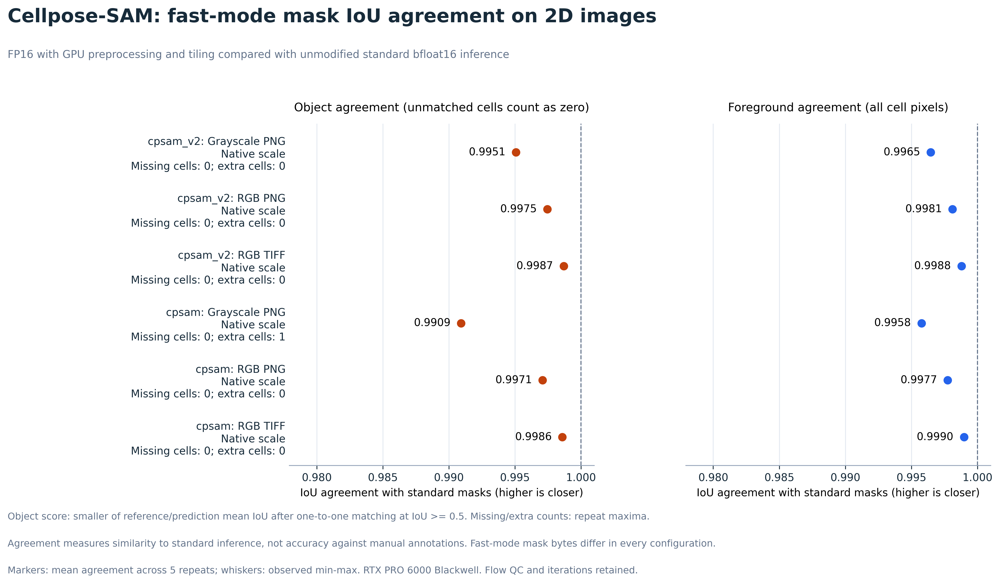
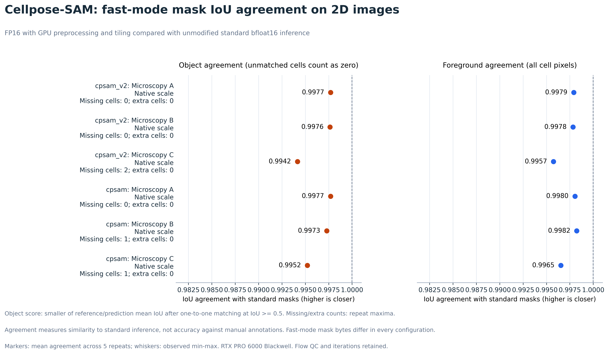
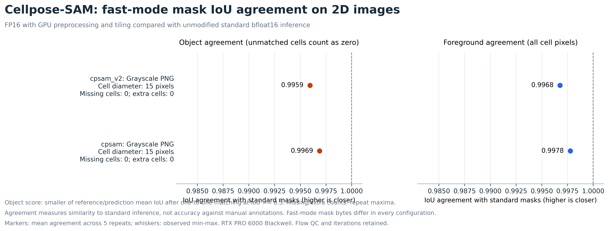

# Cellpose-SAM benchmark figures

These figures are on the **`fast-sam-inference` branch**, targeting Cellpose main.
The separate `fast-cyto3-inference` branch contains the Cellpose 3 figures.

## 3D volume timings

The exact dynamics optimization is measured on a **75 x 75 x 75 voxel grayscale
volume**, using `cpsam_v2`. The optional FP16 fast mode currently falls back to
standard inference for 3D, so these figures measure the exact optimization.

[3D total time SVG](sam_3d_inference.svg) | [PDF](sam_3d_inference.pdf) |
[3D mask construction SVG](sam_3d_mask_effect.svg) | [PDF](sam_3d_mask_effect.pdf)

## Standalone 2D mask IoU plots

Fast FP16 masks are compared with standard bfloat16 inference. These plots show
object and foreground IoU separately, with missing/extra cell counts. IoU measures
agreement with standard inference, rather than ground-truth accuracy.

[Public IoU SVG](sam_2d_iou_public.svg) | [PDF](sam_2d_iou_public.pdf) |
[Supplemental IoU SVG](sam_2d_iou_supplemental.svg) | [PDF](sam_2d_iou_supplemental.pdf) |
[Resized IoU SVG](sam_2d_iou_scaled.svg) | [PDF](sam_2d_iou_scaled.pdf)

## 2D total inference time and speedup

[Public images: time and agreement](sam_fast_inference.png) |
[Supplemental images: time and agreement](sam_fast_supplemental.png) |
[Resized images: time and agreement](sam_fast_scaled.png) |
[Exact optimization: total time](sam_inference.png) |
[Exact optimization: mask construction](sam_mask_effect.png)

Raw measurements and reproduction instructions are in the [benchmark README](../README.md).
